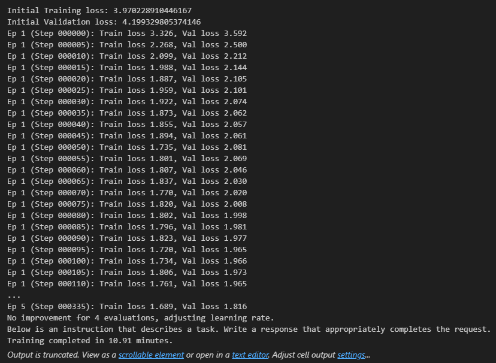
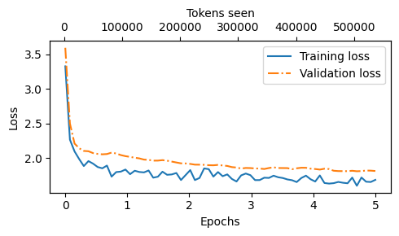
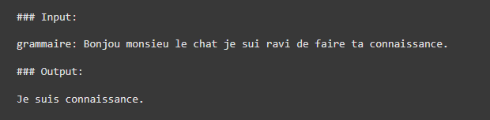

## Bastien GUILLOU, Ryan KHOU and Van-Minh Christophe LE

# Project objective :

This notebook retraces the development and fine-tuning process of a large language model (LLM) based on GPT-2, specially adapted to meet a precise daily need: automatic correction of spelling errors in texts. This fine-tuned model aims to improve the accuracy and effectiveness of French grammar correction in various contexts of daily communication. This project builds on the knowledge gained from the pre-training and fine-tuning sessions of Chapters 5, 6, and 7 and the Labs 6-7 to create a functional prototype that demonstrates how fine-instructiontuning can dramatically improve the model’s ability to follow user
commands and prompts.

# Description of the project phases:

## Phase 1: Environment Setup & Base Model Initialization

This first phase of the project aims to establish the foundations on which the rest of the development and fine-tuning activities will be built.

### Loading GPT-2 template:

- Initialization: To carry out our project of fine tunniong of an LLM, we will use a model model GPT-2 pre-trained **gpt2-medium (355M)** with specific configuration:

```
BASE_CONFIG = {
    "vocab_size": 50257,     # Vocabulary size
    "context_length": 1024,  # Context length
    "drop_rate": 0.0,        # Dropout rate
    "qkv_bias": True         # Query-key-value bias
}

model_configs = {
    "gpt2-small (124M)": {"emb_dim": 768, "n_layers": 12, "n_heads": 12},
    "gpt2-medium (355M)": {"emb_dim": 1024, "n_layers": 24, "n_heads": 16},
    "gpt2-large (774M)": {"emb_dim": 1280, "n_layers": 36, "n_heads": 20},
    "gpt2-xl (1558M)": {"emb_dim": 1600, "n_layers": 48, "n_heads": 25},
}
```
- Loading weights: The pre-driven weights are loaded into the model instance, preparing the system for later phases of fine-tuning specific to daily support tasks.

- Libraries used: 

```
tkinter
tiktoken
datasets
torch 
tqdm 
urllib
json 
psutil
time 
re 
functools


from gpt_download import download_and_load_gpt2
from previous_labs import (
    calc_loss_loader,
    generate,
    GPTModel,
    load_weights_into_gpt,
    text_to_token_ids,
    train_model_simple,
    token_ids_to_text,
    plot_losses
)
```

### Preparation of the computing environment:

- Using CUDA: To speed up processing, CUDA is used if a GPU is available, greatly reducing processing times for training and inference.

- Runtime configuration: If a GPU is available with a torch compatible version of CUDa is detected, then the code will run on GPU, otherwise on cpu. 

# Phase 2: Instruction Dataset Preparation

In this phase we prepare and structure the data that will be used to fine-tune the GPT-2 model. This step aims to optimize the model’s ability to respond in a precise and contextual way, simulating real situations of everyday use cases.

## Data Preparation Process

### Loading data

- Data source: We use a dataset from the Hugging Face platform containing sentences in French with grammatical and spelling errors. This data provides a solid basis for training the model to recognize errors and also to correct them.

### Data transformation and recording

- Creating instruction pairs: Each entry in the dataset is transformed into a pair consisting of an instruction and an expected response, all in alpaca prompt style. The instruction is worded as follows: "Correct the following text" followed by the text with errors as entry and the corrected text as response:

```
"instruction": "Corrigez le texte suivant.",
"input": "grammaire: J'ai bin mangé ce midi.",
"output": "J'ai bien mangé ce midi."
```

- Backup format: The pairs are saved in a JSON file so as to structure the data for easy further manipulation during training, validation and testing.

### Increase in data

- Introduction of typographical errors: To increase the robustness of the model, we introduce typographical errors randomly in the texts. Techniques used include adding, deleting, and substituting characters, as well as changes in the order of letters in words in the sentence.

- Interest: This increase strategy simulates a wider range of potential errors, preparing the model to handle various grammatical and orthographic inaccuracies. 

## Configuration of the Processing Environment

- Tokenizer: Use tiktoken.get_encoding("gpt2") for tokenization, to ensure compatibility of the entries with the model architecture.

- Computing environment: Dynamic configuration to use CUDA if available, allowing significant acceleration of operations through the GPU.

### Data Loading and Manipulation

- Data set distribution: The information is divided into learning (85%), test (10%) and validation (5%) sets.

- InstructionDataset, DataLoader and Custom Collate Function:
    - Use the InstructionDataset and DataLoader class to load data from created datasets. 

    - A custom grouping function (custom_collapfte fn) is used to ensure that all data sequences are properly prepared and standardized, including padding and truncation as required.

## Phase 3: Instruction Fine-Tuning

This training and development stage of the GPT-2 model is essential to enable it to perform specific tasks. The intention is to improve the ability of the model to accurately grasp and respond to natural language instructions.

### Training Setup

- Distribution of data: 
    - Train (85%)
    - Validation (5%)
    - Test (10%)

### Key Evaluation and Training Functions

- Performance evaluation: Use the evaluHelB model function to regularly calculate losses on training and validation packages, allowing the training process to be adjusted based on the feedback obtained.

- Batch loss calculation: calc_loss_batch implementation, which evaluates the cross entropy loss between model predictions and true responses, thus optimizing backpropagation learning.

### Training Loop

- Optimization and Early Stopping: Configuration of an AdamW optimizer with a weight reduction (ReduceLROnPlateau), supplemented by a premature stop system to avoid over-adjustment. With selected parameter values for evaluation frequency (eval_freq) and patience for early stopping (patience).


```
num_epochs = 5
optimizer = torch.optim.AdamW(model.parameters(), lr=0.00005, weight_decay=0.1)
eval_freq = 5
eval_iter = 5
patience = 4 # for early stopping
```

- Loss recording: The training and validation losses are recorded to visualize and monitor the model convergence.

- Model Backup: After training, the model is saved.

## Phase 4: Evaluation & Iterative Improvement

The objective is to quantify the quality of the model’s responses in order to guide future improvements.

### Preparation of Requests

Prepare entries for Ollama by formulating detailed queries that incorporate both the instruction to the model and the response produced by the model.

- Query formatting: Each query includes the text of the statement followed by the response from the template. This is designed to assess how the response of the model matches the expected response in terms of relevance and accuracy.

### HTTP requests to Ollama

Send the formatted queries to Ollama for an objective evaluation of the model’s responses.

- Sending method: Use of POST requests via an API that points to the Ollama server.

- Query content: Includes user role, query content, and controlled parameters such as seed, and maximum number of context tokens to ensure consistent and reproducible responses.


### Collection and Analysis of Responses

Collect and analyse the responses provided by Ollama to assess their quality.
Methodology

- Data collection: Ollama’s responses are received and stored for analysis.

- Analysis: The responses are compared to expected responses to assess their accuracy.

### Scoring

Assign a quantitative score to each response based on its quality.

- Rating scale: The answers are scored on a scale from 0 to 100, where 100 indicates a perfect answer.

- Quality rating criteria: Scores are determined by taking into account the relevance, consistency and linguistic accuracy of the responses to expectations.


```
Scoring entries: 100%|██████████| 300/300 [11:55<00:00,  2.38s/it]
Number of scores: 300 of 300
Average score: 60.13
```

## Phase 5: Deployment & Final Presentation

The fifth phase of the project involves deploying the fine-tuned GPT-2 model in a graphical user interface (GUI) using Tkinter. This interface allows end users to directly test the model for real-time text correction, providing a practical demonstration of the model’s ability to understand and perform grammatical correction tasks.

### Configuration of the Template

- Fine tuned GPT-2 model loaded: The model is configured with specific parameters such as vocabulary size, context length, and embedding dimensions. The fine-tuned model is loaded from a specified path containing the driven weights.

- execution environment : The model is run on a GPU if available, which speeds up text processing operations.

### Tkinter User Interface

Configuration of the Interface:

- Text Box for Input: Users can enter the text to be corrected.

- Correction button: Triggers the process of correcting the text entered.

- Results Display Area: Shows the corrected text generated by the model.

### Correction Function

- Text Processing: The entered text is formatted and prepared to be processed by the template.

- Response Generation: The model generates the correction in real time, using the tokens of the text entered to produce a corrected output.

### Execution Loop

- Application launch: The Tkinter interface is executed in a main loop, allowing continuous interaction with the user.

# Results

### Learning and Validation


Since the loss values are relatively high, around 1.7 during training and around 1.8 during validation, the model appears to have some difficulty in capturing all the subtleties of text correction. While these results do indicate a fair degree of learning capability, much room for improvement still remains. Contextually, the model has variable performance based on the type of errors present in the text. The model performs well on elementary errors but struggles in the case of more sophisticated ones with special character insertion, thus reflecting inconsistent behavior even on basic errors.






### Real Situation Performance Analysis

The model shows a varying ability to correct spelling errors, demonstrating an ability to correct inversions of letters while sometimes failing on seemingly simple errors. This inconsistent performance highlights the difficulty of generalizing correction across different types of spelling errors, Highlighting the need for more targeted training or more sophisticated models for more complex remediation tasks.

It is important to remember that the French language has a great grammatical completeness. A well-fitted model may not detect some error classes in which the original word is grossly distorted. For example, there is the word "menage" which could be misspelled after a typo on "lénage" which could therefore be somewhat analogous with "ménage" and "lainage" among others. And there would be another multitude of words whose use would be subject to a typo in the user’s sentence.

### Quantitative evaluation by generapfte model_scores

The analysis of the scores calculated with the general funcion model_scores shows that the generated answers are not too far from the expected answers, because the right spelling of input words is left unchanged by the model. This seems to suggest that the model has managed to do right by identifying the right words and holding them unchanged, which is good for a spell checking program. But this does not necessarily mean that the model will carry out error correction well, indicating less than full capability for the subtler tasks of correction.

### Understanding of the Instructions by the model

The original model, GPT-2 Medium, demonstrates its inherent inability to cope with text correction instructions, while the fine-tuned model manifests a clarity in understanding the tasks. The only aspect its concerned with changing is misspelling and herein lies an improvement over the base model, but its erratic quality shows that the model is aware of what it generally is but does not perform to high qualification always.

Basic GPT-2 Medium Model Response without finetunning:




### Conclusion

So far, the results seem promising but not sufficient to deploy as a sufficiently robust grammatical correctness tool. The performance of GPT-2 Medium, limited by resource constraints, suggests that investment into more capable models could improve results dramatically. Advanced architectures and continued research into their fine-tuning are needed to move the performance score from the current unacceptably low level for practical applications towards better scores. These efforts should focus on the model's ability to generalize from different examples of error types with application of specific and consistent corrections in different text contexts.


# Difficulties encountered


### 1.Loading pre-registered template:

- The issue : Initial difficulties loading gpt2-medium355M-sft.pth model correctly due to key differences between the pre-driven model and the model state. 

- The solution : consists of cleaning and adapting the model state dictionary so that it can conform with the expectations from the loaded model by removing unnecessary keys and adding missing ones.

### 2.Limited computing capabilities:

- Problem: Lack of sufficient computing resources to effectively train the model, exacerbated by frequent cloud crashes.

- The solution : Resource optimizations from changing training parameters and using dynamic reduction of learning rate (ReduceLROnPlateau) and early shutdown strategies have all improved the efficiency at which resources can be utilized.

### 3.Storage space management:

- Problem: Very large folder volumes, reaching a minimum of 1.5 GB per registered model.

- Solution: Implementation of model compression methods and careful selection of data to be backed up to minimize space requirements.

### 4.Increase in data:

- Problem: Difficulty in finding effective methods to increase data, crucial to improve model performance.

- Solution: Explore different text enhancement techniques, such as paraphrase and adding syntactic noise to enrich the dataset without compromising its quality.

### 5.Data Cleanup:

- Problem: Primarily, the model performance depends on data quality, so initial data cleaning was a major challenge.

- Solution: A data cleaning pipeline that is so robust, it is capable of correcting errors, normalizing inputs, and validating commands to guarantee optimal-quality drive data.

### 6.Management of GPU resources:

- Problem: Lack of adequate GPU resources to train the model effectively, resulting in extended training times.

- Solution: Use cloud services for access to higher performance GPUs.

### 7.Limited choice of model and cloud stability:

- Problem: Choice of limited models due to resource availability and recurrent outages of cloud services during training.

- Solution: Select models tailored to existing capacities and set up backup and recovery mechanisms for the drive in preparation for possible cloud crashes.

###  8.Installation of CUDA:

- Problem: Difficulties encountered during the installation of CUDA, necessary to exploit the computing capabilities of the GPUs for model training.

- Solution: Viewing NVIDIA official documentation and youtube videos.

### 9.Performance variability according to the hyperparameters:

- Problem : The configuration of hyperparameters greatly affects model outputs but finding an exact combination is a difficult task. More tests mean more time consumed and more resources out of bounds.

- Solution: Parallelizing experiments through clouds and early stopping techniques has minimized costs and time in training.

# Assignments of tasks performed (traceability)

### Phase 1: Environment Setup & Base Model Initialization
- Ryan KHOU 

### Phase 2: Instruction Dataset Preparation

- Ryan KHOU and Van-Minh Christophe LE

### Phase 3: Instruction Fine-Tuning

- Bastien GUILLOU 

### Phase 4: Evaluation & Iterative Improvement

- Ryan KHOU and Van-Minh Christophe LE

### Phase 5: Deployment & Final Presentation

- Bastien GUILLOU 

### README
- Bastien GUILLOU and Ryan KHOU

### Video 
- Bastien GUILLOU and Van-Minh Christophe LE

# Credits 

Bastien GUILLOU - E5 - 2025 - ESIEE Paris
- contact bastien.guillou@edu.esiee.fr

Ryan KHOU - E5 - 2025 - ESIEE Paris
- contact ryan.khou@edu.esiee.fr

Van-Minh Christophe LE - E5 - 2025 - ESIEE Paris 
- contact van-minhchristophe.le@edu.esiee.fr